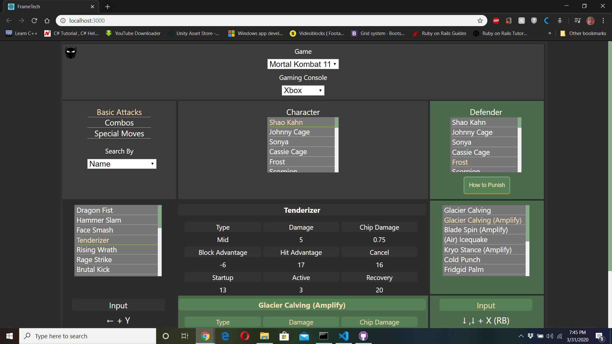

# FrameTech
Web based Application using Mongo Atlas database to store frame data of all moves from characters in specified fighting games. Allows the comparison between different moves supplying best possible move afterwards for both attacker and defender.

## [Live Link](https://frametech.netlify.app/)

## Built With

- HTML, CSS
- JavaScript
- React.js
- MongoDB
- Node.js
- NPM Webpack

## Author

👤 **Aaron Rory**

- Github: [@Aaron-RN](https://github.com/Aaron-RN)
- Twitter: [@ARNewbold](https://twitter.com/ARNewbold)
- Linkedin: [Aaron Newbold](https://www.linkedin.com/in/aaron-newbold-1b9233187/)
